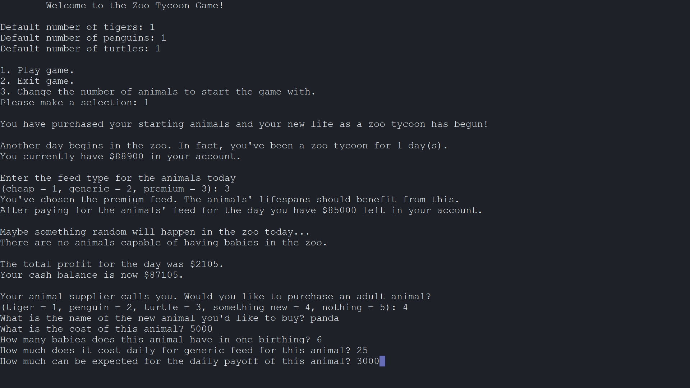

# Zoo Tycoon

This program allows the user to play the Zoo Tycoon Game. A Zoo class object will be instantiated and its startGame function will be called allowing the user to play the game as many times as she/he wishes. The user may also specify the number of tigers penguins, and turtles she/he would like to start the game with.

The Animal class represents an animal that is part of a zoo. It is the base class for other derived classes of animals. Member variables include traits common to all zoo animals including age, cost, numberOfBabies, baseFoodCost, and payoff. Member functions include a constructor which takes parameters to initialize all of its member variables, get and set functions for all variables as well as a getName function which simply returns what kind of animal it is, which in this case is simply "animal". 

The NewAnimal class represents a user-specified animal that is part of a the zoo. It is derived from the Animal class. It has a member variable, name, which is used to hold what kind of animal it is, which is specified by the user. It has a constructor which is used to initialize member variables. It has a getName function which returns the kind of animal it is.

The Zoo class represents a game of zoo tycoon in which the user will run a zoo as a business. The class will contain pointers to arrays of pointers to Animal objects. When animals are added to the zoo, objects of the corresponding derived Animal class will be added to the array, which is dynamically allocated. When the array is full, it will be reallocated at twice the current size. There will be a pointer to an array for each derived class including Tiger, Penguin, Turtle, and NewAnimal. There will also be member variables to keep track of the number of each derived Animal object, and to keep track of the amount of money the tycoon has to work with.

## System Requirements

Linux, g++, c++11, GNU Make

## Compilation

Use Make to compile: `$ make`

## Usage

Run executable: `$ ./main`

## Example Usage

